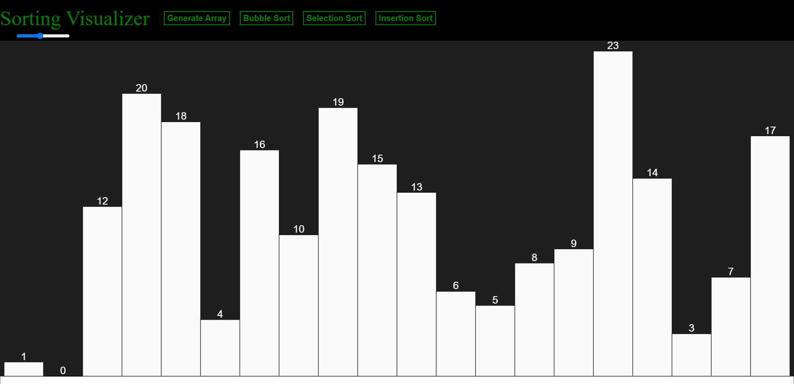
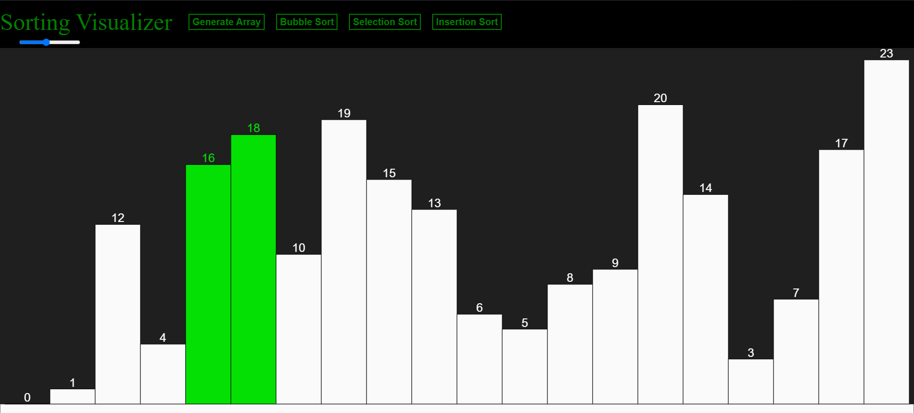
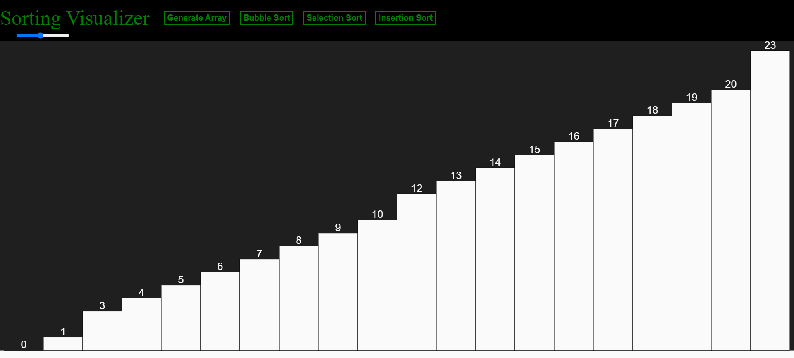

<!-- ### Project Guide -->
<!-- Add name and designation, if any -->

### Mentors

- Amandeep Singh
- Tejas Sankalp
- Mehul Todi
- Shashank SM

### Members

- Yuvraj Wale
- Praveen Kumar
- Jaheer Khan
- Khushi Suresh Muddi
- Saket Zingade
- Garvit Goyal
- Ankur Chaudhary

## Acknowledgements

To the success of the project, the mentors were a huge help. From resource provision to keeping everyone going in the project, every part of the experience was a really well put and professional. Being the first software project of most of us, this was a lot of fun to put together.

## Aim

    This project aims to visualise the workings of algorithms, specifically Sorting algorithms by simulating a visualiser
    by using concepts of HTML, CSS, p5.JS

## Introduction

Data in today's world holds a lot of meaning. Heaps and heaps of data are created, modified and deleted in company servers every day. But sometimes this data can clump up into messy unsorted groups. This problem is overcome by Sorting.
Sorting algorithms are sets of instructions which sort or rerrange a set of data into much more intuitively accessible set. There exist various sorting algorithms over the years of development of computers, each with its own unique features and shortcomings.

To understand these set of code might be hard for one. Hence a visualiser such as this can help to understand the step-by-step working of an Algorithm.

## The Algortithms

### Bubble sort

source: [Link](https://www.geeksforgeeks.org/bubble-sort/)

Bubble Sort is the simplest sorting algorithm that works by repeatedly swapping the adjacent elements if they are in the wrong order. This algorithm is not suitable for large data sets as its average and worst case time complexity is quite high.

### Selection Sort

source: [Link](https://www.geeksforgeeks.org/selection-sort/)

The selection sort algorithm sorts an array by repeatedly finding the minimum element (considering ascending order) from unsorted part and putting it at the beginning. The algorithm maintains two subarrays in a given array.
-> The subarray which is already sorted.
-> Remaining subarray which is unsorted.
In every iteration of selection sort, the minimum element (considering ascending order) from the unsorted subarray is picked and moved to the sorted subarray.

### Insertion Sort

source: [Link](https://www.geeksforgeeks.org/insertion-sort/)

Insertion sort is a simple sorting algorithm that works similar to the way you sort playing cards in your hands. The array is virtually split into a sorted and an unsorted part. Values from the unsorted part are picked and placed at the correct position in the sorted part.

Characteristics of Insertion Sort:
-> This algorithm is one of the simplest algorithm with simple implementation.
-> Basically, Insertion sort is efficient for small data values
-> Insertion sort is adaptive in nature, i.e. it is appropriate for data sets which are already partially sorted.

## The Algorithm Visualiser

This visualiser creates a visual array of boxes, each of a different length to denote a number they contain. By selecting from the list of Algorithms given, the array automatically sorts itself one step at a time with visual indicators for the same.

## The Website Making

### HTML and CSS

To create a platform for this visualizer to run on, HTML was a necessity which, along with CSS makes for the foundation of the simulator.

### JavaScript

Since HTML and CSS are only to make the template of the website, the instructions for the simulator were written Javascript, specifically the p5 version of it

## Working

Each of the algorithms in the simulator have a very specific set of instructions to follow. Each compare, swap, loop is visually shown by the modified box colors and animations. Even a generate array function has been added to show the working of these algorithms on any random array of numbers
Given below is a rough working of the Visualiser.

## Conclusion

- This visualiser is an excellent way of understanding the fundamentals of sorting or data
- This project is focused on a working website development with all elements of HTML, CSS and JS

## References

1. [p5.js Tutorial](https://www.youtube.com/playlist?list=PLRqwX-V7Uu6Zy51Q-x9tMWIv9cueOFTFA)
2. [CSS](https://www.codecademy.com/learn/learn-css)
3. [A Simple GFG Simulator](https://www.geeksforgeeks.org/bubble-sort-visualization-using-javascript/)
